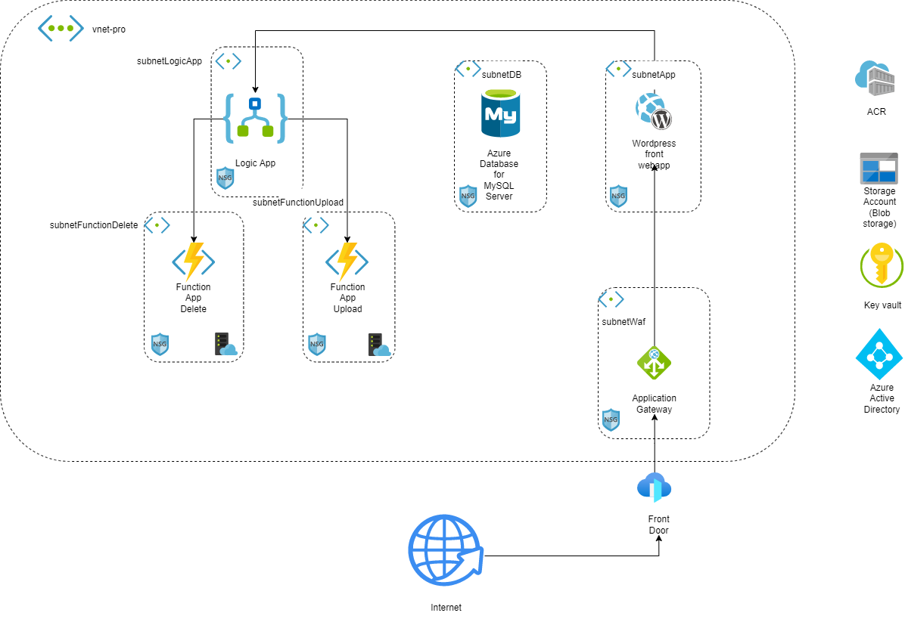

  

  <h1 align="center">Assessment for Azure Advanced Infra TAP: Diagram of Architecture</h1>

  

  <h2>READ ME BEFORE STARTING</h2>
  
You have received this assessment as part of the Launchpad assessment process at Nordcloud. In sending this to you, we are testing a few skills including the following:

  <ul>
    <li>Architecture design</li>
    <li>Ability to present solutions</li>
    <li>Engineering skills </li>
    <li>Documentation</li>
    <li>Security</li>
  </ul>

  
A few notes: Please try to deliver the best solution you can, given the time that you have available. Concentrate on the components that you think matter most. If there are any parts of this assessment that are not clear, please do not hesitate to reach out to your People Leaders for clarification. This assignment, by design, leaves some room for critical thinking and questioning.

  
Study the assignment, create your own implementation and prepare to demo/explain it. The goal is not to develop an exhaustive and perfect solution with all the bells and whistles, but to reflect your experience and approach to this assignment. However, it does need to fulfill the acceptance criteria. Please also keep the “Business Case” in mind while designing your solution.

  
Good luck!

  <h2>Deliverables</h2>
  <ul>
    <li>The solution must be delivered using a private git repository on GitHub or GitLab. Make sure to add the user ‘nc-tech-review’ as a collaborator to the repository.</li>
    <li>All the code related to your implementation, in a form that is deployable.</li>
    <li>Comprehensive and understandable documentation of your solution.</li>
    <li>Presentation of your solution.</li>
  </ul>

  <h2>Acceptance Criteria for the Implementation</h2>
  <ul>
    <li>Acceptance Criteria for the Implementation</li>
    <li>There should be no obvious security flaws.</li>
    <li>The application must return consistent results across sessions.</li>
    <li>The implementation should be built in a resilient manner </li>
    <li>Observability must be taken into account when implementing the solution.</li>
    <li>The deployment of the application and environment should be automated.</li>
  </ul>

  <h2>Goal</h2>
  
In this assessment, you will deploy a highly available, resilient and secured microservice architecture spanning multiple accounts using infrastructure as code.

  <h2>Business Case</h2>
  
Company A, has a legacy and monolithic application which allows users to store photos.  It is hosted on an outdated platform in more than 30 data centers throughout the world on premises. Their impressive growth is positive, but the company faced issues with scaling of their website.

  
Now the company wants to  embark on an application modernization journey and opt for a microservice architecture. A microservice architecture allows applications to be composed of several loosely coupled discreet services that are highly available, independently deployable, scalable, and maintainable.

  
The company wants to have a multi-account environment with each account belonging to an individual business unit and each individual business unit will be responsible for  a microservice. The company came up with the idea of 4 business units where first business unit will take care of the front-end(wordpress), the second business-unit will take care of uploading photos, the third business-unit will take care of deleting photos and the fourth business-unit will take care of the database. Their microservices implementations reside in the Virtual Public Clouds (VPCs) of their respective accounts. 

  
Each microservice should be highly available, resilient and secured. They do not know what kind of traffic to expect so the solution should be able to adapt to traffic spikes.

  
In the case of service disruption or accidental deletion or corruption of data, they would like to recover business services in a timely and orchestrated manner. The backup and disaster recovery solution has to be simple to architect, cloud-native, highly available, and resilient. Each business unit wants to be able to release new versions of the application multiple times per day, without requiring any downtime.

  
You are tasked to deliver a Proof of Concept for their new website. Your role is to design and implement a solution architecture that covers the previously mentioned requirements, using cloud capabilities. The solution should also consider improving the development experience for new developers by simplifying the building, testing, and running of the application and making it easy to maintain, develop in the future. The solution should be optimized for costs.

  <h2>Environment</h2>
  
You are expected to use your own sandbox environment/account in the relevant cloud provider. 

